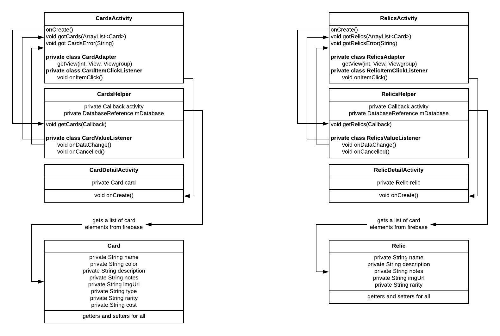
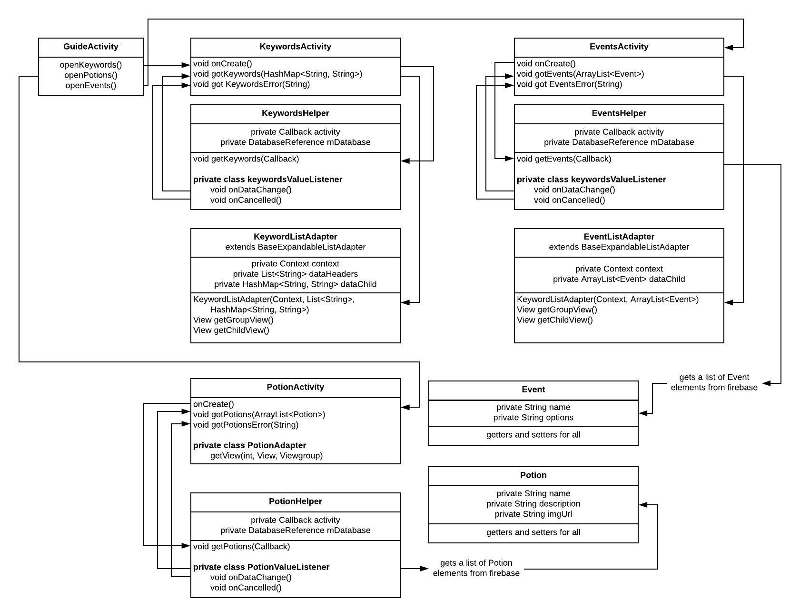

# Design

## Images

## Class diagrams

## API's and Frameworks
*Firebase to set up a database
*JSoup to get the initial data by scraping
*Picassa to show images from the web.

## Data sources
I used Jsoup to scrape the data from https://slaythespire.gamepedia.com/Slay_the_Spire_Wiki.
I tried used the Mediawiki API but it didn't work as well as i had hoped because the site isn't that well orginized.

## Database tables and fields

* Cards
  * name
