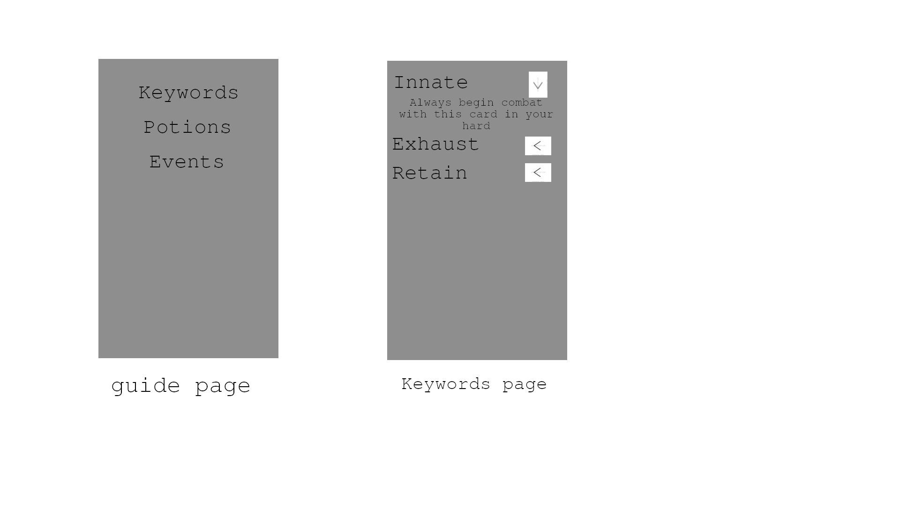

# Slay the Spire Helper
an app for the game Slay the Spire

## Problem Statement
The game Slay the Spire doesn't have a place where one can easely take notes and strategize about the game. 

## Solution

### Summery
Make an app where all the info is easely stored and where someone can make notes.

### visual sketch

The Main page will be a simple listview with the three options.
The cards page is a list of all cards which can be filtered and sorted in any way you like.
The relic page will be very similar to the cards page.

The cards Detail is a page with detailed info of a cards as well as a field for notes, a field cards and relics that conbo well with the card.
The relic detail will be very similar to the cards page.

The guide page is a simple listview.
The keyword page is a listview with all the keywords. When an item is clicked the item will extend with the explenation beneath it.

### main features
*all info off the game easely avalible.
*the possibilty of taking notes and giving scores to cards/relics

### MVP
The above mentioned features well implemented and a possibility.

### Extentions when the base is done
*When you start a run in the normal game you can run the app along with it and the app will give you tips.
*Get an overview of a run when finished 

## Prerequisites

### data sources
*https://slaythespire.gamepedia.com/Slay_the_Spire_Wiki has all the data that i will require, I hope to find an api and otherwise I will build my own scraper.

### external components
*firebase for the database
*SQLite for the possibility of a personelised database next to the global firebase database

### similar apps
A sort of similar app to this one is BuidDota2 for Dota 2.
This is an app made for players of the game Dota 2.
The creator of this app tries to create a place where all the information of the is easy to get.
On top off this the creator also added the possibilty of making your own skill builds.

### the hardest parts
making a system that can filter and sort the list views efficiently and dynamicly. 
